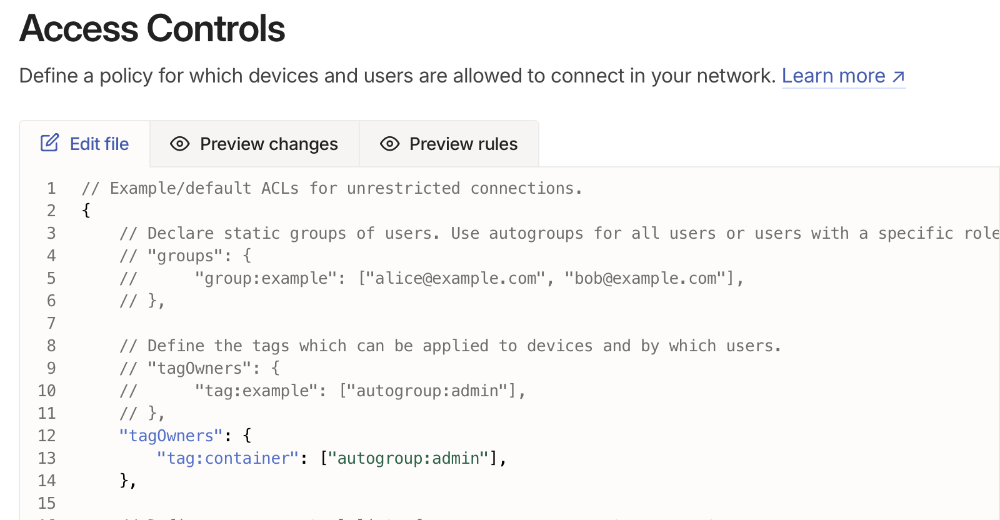
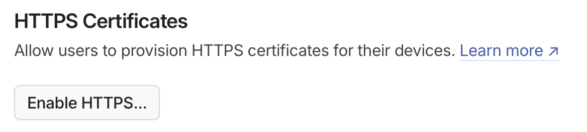
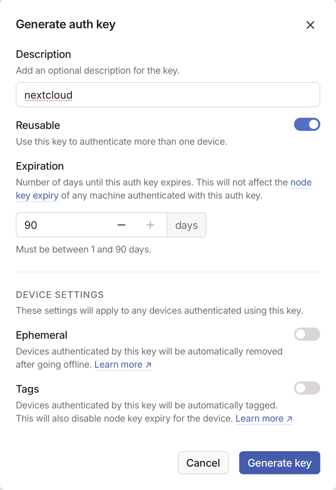
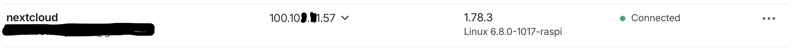
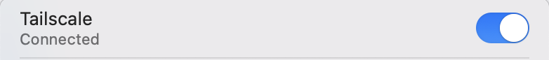
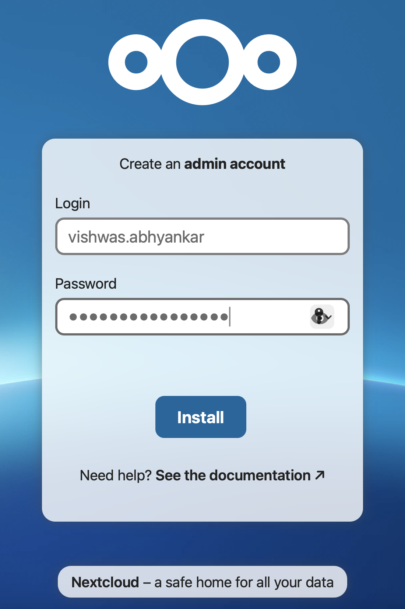
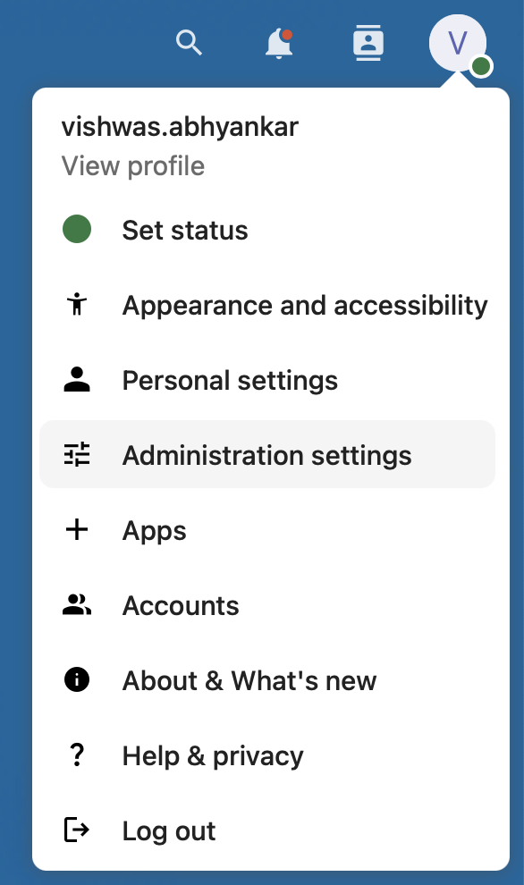
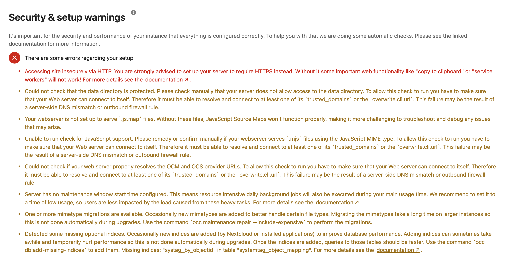
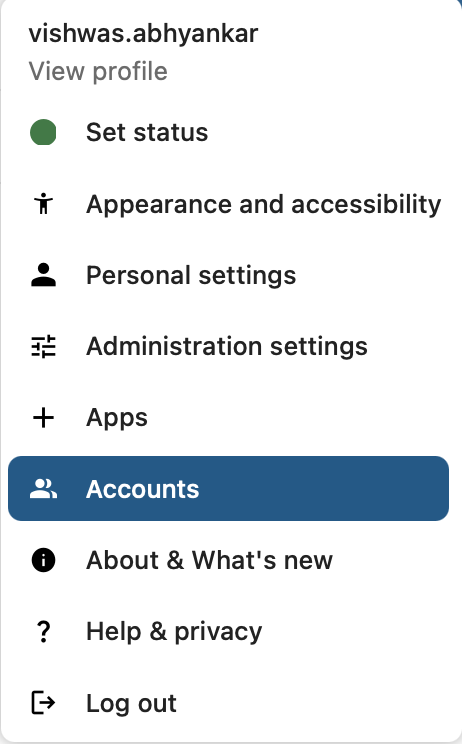
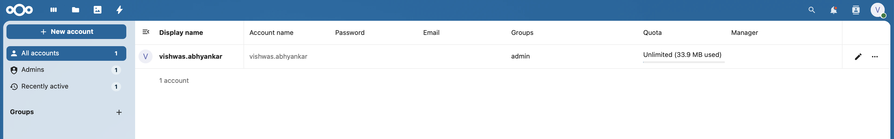

# Nextcloud Setup with Docker and Tailscale

- This setup is to host Nextcloud on Docker running on Raspberry PI-Ubuntu combo
- An external storage device (hard drive) is a attached to the Raspberry PI on which all your nextcloud data will be stored
- It uses Tailscale for networking and https as well
- Using which you can access your Nextcloud server from anywhere in the world

# Running Nextcloud on Docker vis Tailscale Networking

## Preparing hard drive ready for nextcloud

- Attach hard drive to raspberry pi

```bash
lsblk
```

```plaintext
NAME        MAJ:MIN RM   SIZE RO TYPE MOUNTPOINTS
loop0         7:0    0  33.7M  1 loop /snap/snapd/21761
loop1         7:1    0  38.7M  1 loop /snap/snapd/23546
sda           8:0    0 931.5G  0 disk
├─sda1        8:1    0   200M  0 part
└─sda2        8:2    0 931.3G  0 part
mmcblk0     179:0    0 119.4G  0 disk
├─mmcblk0p1 179:1    0   512M  0 part /boot/firmware
└─mmcblk0p2 179:2    0 118.9G  0 part /
```

- Format the drive

```bash
sudo mkfs.ext4 /dev/sda
```

```plaintext
mke2fs 1.47.0 (5-Feb-2023)
Found a gpt partition table in /dev/sda
Proceed anyway? (y,N) y
Creating filesystem with 244182272 4k blocks and 61046784 inodes
Filesystem UUID: 3235db8a-00d6-4183-8e0f-b247e91107d1
Superblock backups stored on blocks:
	32768, 98304, 163840, 229376, 294912, 819200, 884736, 1605632, 2654208,
	4096000, 7962624, 11239424, 20480000, 23887872, 71663616, 78675968,
	102400000, 214990848

Allocating group tables: done
Writing inode tables: done
Creating journal (262144 blocks): done
Writing superblocks and filesystem accounting information: done
```

- Create a directory to mount the newly formatted drive

```bash
sudo mkdir -p /mnt/files
lsblk
```

```plaintext
NAME        MAJ:MIN RM   SIZE RO TYPE MOUNTPOINTS
loop0         7:0    0  33.7M  1 loop /snap/snapd/21761
loop1         7:1    0  38.7M  1 loop /snap/snapd/23546
sda           8:0    0 931.5G  0 disk
mmcblk0     179:0    0 119.4G  0 disk
├─mmcblk0p1 179:1    0   512M  0 part /boot/firmware
└─mmcblk0p2 179:2    0 118.9G  0 part /
```

- Mount the newly formatted drive

```bash
sudo mount /dev/sda /mnt/files/
sudo ls /mnt/files/
```

```plaintext
lost+found
```

- Add permanent mount & add following line at the end of the file

```bash
echo "/dev/sda /mnt/files ext4 defaults 0 2" | sudo tee -a /etc/fstab
```

## Tailscale Setup

- [Sign up to Tailscale](https://login.tailscale.com/start) using any of the available options

- Under `Access controls` add `tagOwners` like below
  <br/>

- Under the tab `DNS` -> `HTTPS Certificates`
  <br/>

- Under the tab `Settings` -> `Generate auth key`
  <br/>

## Nextcloud Setup

- Install docker

```bash
sudo apt update && sudo apt upgrade -y
sudo snap install docker
```

- Clone the repository

```bash
git clone https://github.com/avadhootabhyankar/nextcloud-ts.git
```

- Change directory to github repo

```bash
cd ~/nextcloud-ts
```

- Create external docker volumes so that all data is stored on external hard drive

```bash
sudo mkdir -p /mnt/files/docker-volumes/db
sudo mkdir -p /mnt/files/docker-volumes/nextcloud

sudo docker volume create --driver local --opt type=none --opt device=/mnt/files/docker-volumes/db --opt o=bind db
sudo docker volume create --driver local --opt type=none --opt device=/mnt/files/docker-volumes/nextcloud --opt o=bind nextcloud
```

- Inspect externally created docker volumes

```bash
sudo docker volume inspect db
```

```json
[
  {
    "CreatedAt": "2025-01-17T02:31:42Z",
    "Driver": "local",
    "Labels": null,
    "Mountpoint": "/var/snap/docker/common/var-lib-docker/volumes/db/_data",
    "Name": "db",
    "Options": {
      "device": "/mnt/files/docker-volumes/db",
      "o": "bind",
      "type": "none"
    },
    "Scope": "local"
  }
]
```

```bash
sudo docker volume inspect nextcloud
```

```json
[
  {
    "CreatedAt": "2025-01-17T02:31:48Z",
    "Driver": "local",
    "Labels": null,
    "Mountpoint": "/var/snap/docker/common/var-lib-docker/volumes/nextcloud/_data",
    "Name": "nextcloud",
    "Options": {
      "device": "/mnt/files/docker-volumes/nextcloud",
      "o": "bind",
      "type": "none"
    },
    "Scope": "local"
  }
]
```

- Edit db.env and .env Files to Set Desired Passwords
  - Edit `db.env`
    - Replace `MYSQL_ROOT_PASSWORD` value with strong password
    - Replace `MYSQL_PASSWORD` value with strong password
  - Edit `.env` file
    - Replace `REDIS_PASSWORD` value with strong password
    - Replace `TAILSCALE_AUTH_KEY` value with Auth Key Generated from Tailscale Settings

- Up Nextcloud service

```bash
sudo docker-compose up -d --remove-orphans
```

```plaintext
[+] Running 6/6
 ✔ Network nextcloud-ts_default                    Created       0.1s
 ✔ Volume "nextcloud-ts_tailscale-data-nextcloud"  Created       0.0s
 ✔ Container nextcloud-ts-db-1                     Started       0.3s
 ✔ Container nextcloud-ts-redis-1                  Started       0.3s
 ✔ Container nextcloud-ts-ts-network-1             Started       0.3s
 ✔ Container nextcloud-ts-app-1                    Started       0.1s
```

```
sudo docker ps
```

```plaintext
CONTAINER ID   IMAGE                        COMMAND                  CREATED         STATUS         PORTS      NAMES
643c3ff0d3b9   nextcloud:latest             "/entrypoint.sh apac…"   3 minutes ago   Up 3 minutes   80/tcp     nextcloud-ts-app-1
edb41224fa60   mariadb:11.4                 "docker-entrypoint.s…"   3 minutes ago   Up 3 minutes   3306/tcp   nextcloud-ts-db-1
d42995de6995   redis                        "docker-entrypoint.s…"   3 minutes ago   Up 3 minutes   6379/tcp   nextcloud-ts-redis-1
50d875a06efa   tailscale/tailscale:latest   "/usr/local/bin/cont…"   3 minutes ago   Up 3 minutes              nextcloud-ts-ts-network-1
```

- [Login to Tailscale](https://login.tailscale.com/admin/machines) using your account

- `nextcloud` machine should show up under `Machines` tab
  <br/>

- Copy the FCDN by clicking on the down arrow next to IP address of `nextcloud` machine

  - Note: The IP address is of the tailnet and not the public IP address

- [Install `Tailscale` client](https://tailscale.com/download) for your devices (Mobile/Computer)

- Login from your account on `Tailscale` client

- Connect to your Tailnet
  <br/>

- In the browser on Computer access Nextcloud Machine using https://FCDN similar to below

  - It will create a HTTPS certificate first using `Let's Encrypt` so first load will take some time
    https://nextcloud.taileXXXX.ts.net

- Once Nextcloud landing page is loaded create a first Admin account

- Set a admin username and strong password
  <br/>

- Open Administration Settings
  <br/>

- Time to fix `Security & setup warnings`
  <br/>

  - Edit config.php on Nextcloud container and/update the lines as per the config.php present in this repository
    - `#` comments are added to indicate which lines to add/update

  ```bash
  sudo docker exec -it <container-id> bash
  ```

  - Inside the container replace contents of config.php with the one present in this repo

  ```bash
  apt update && apt install vim -y && vi config/config.php
  ```

  - This will remove couple of the warnings from security & setup warnings

  ```bash
  sudo docker exec -u www-data nextcloud-ts-app-1 php occ maintenance:repair --include-expensive
  sudo docker exec -u www-data nextcloud-ts-app-1 php occ db:add-missing-indices
  sudo docker exec nextcloud-ts-app-1 bash -c "echo 'Header always set Strict-Transport-Security \"max-age=15552000; includeSubDomains; preload\"' >> /etc/apache2/conf-available/security.conf && apachectl restart"

  ```

  - Restart Nexecloud container

  ```bash
  sudo docker-compose restart app
  ```

- Create user accouts from `Accounts`
  <br/>

  <br/>

# Stop Nextcloud

```bash
cd ~/nextcloud-ts
sudo docker-compose down
```

# Stop Nextcloud and Deep Clean Up

- Stop Nextcloud and other related services

```bash
cd ~/nextcloud-ts
sudo docker-compose down
```

- Remove the external volumes and delete directories

```bash
sudo docker volume remove db
sudo docker volume remove nextcloud
sudo docker volume remove nextcloud-data
sudo rm -rf /mnt/files/docker-volumes/*
```

- Remove other dangling volumes, images and networks

```bash
sudo docker volume prune -a
sudo docker image prune -a
sudo docker network prune
```

- Remove `nextcloud` machine from [`Tailscale Machines`](https://login.tailscale.com/admin/machines)
